## 1、standard-默认模式

这个模式是默认的启动模式，即标准模式，在不指定启动模式的前提下，系统默认使用该模式启动Activity，每次启动一个Activity都会重写创建一个新的实例，不管这个实例存不存在，这种模式下，谁启动了该模式的Activity，该Activity就属于启动它的Activity的任务栈中。这个Activity它的onCreate()，onStart()，onResume()方法都会被调用。

##### 配置模式
```
		<activity
            android:name=".StandardActivity"
            android:launchMode="standard">

        </activity>
```
##### 点击启动
启动了MainActivity页面之后，出现如下：
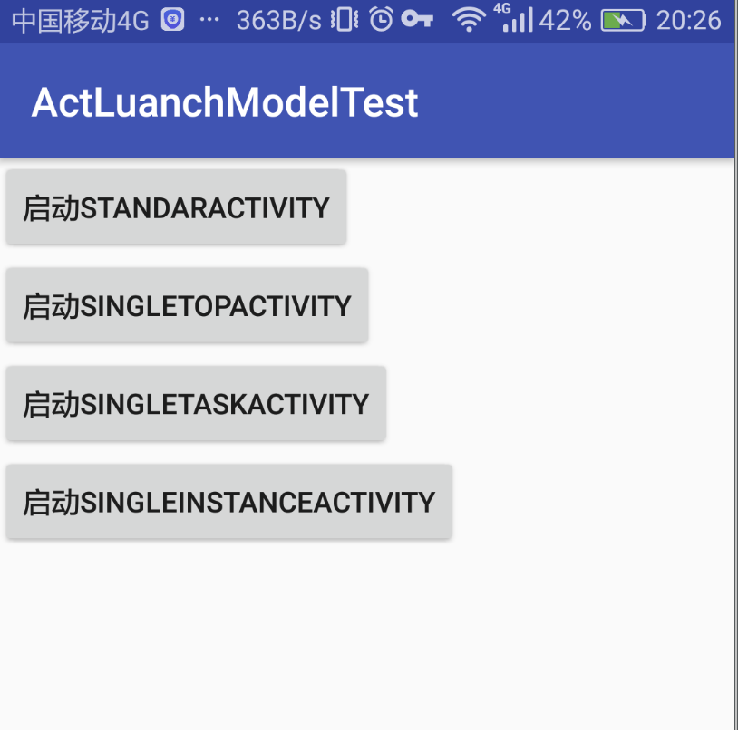
点击 第一个 按钮，
进入 StandardActivity 页面

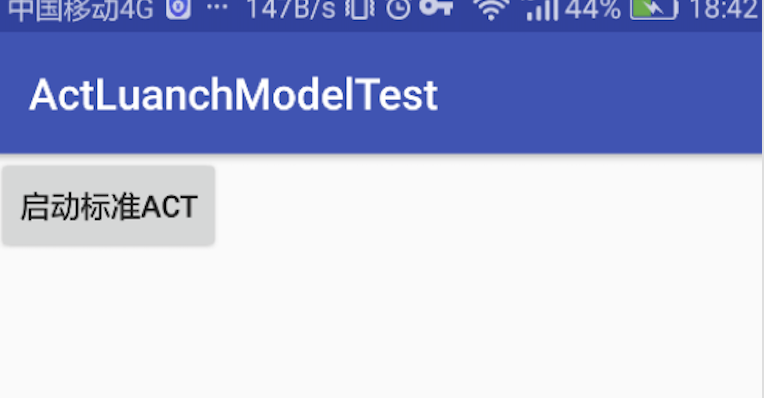

点击 启动标准ACT 按钮，新启页面，新启动页面又点击

##### 输出日志

```
1340-1340/com.godfather.actluanchmodeltest D/BaseActivity: onCreate: MainActivity hashCode:77616355 taskId:9298
1340-1340/com.godfather.actluanchmodeltest D/BaseActivity: dumpTaskAffinity: taskAffinity = com.godfather.actluanchmodeltest
1340-1340/com.godfather.actluanchmodeltest D/BaseActivity: onCreate: StandardActivity hashCode:208435735 taskId:9298
1340-1340/com.godfather.actluanchmodeltest D/BaseActivity: dumpTaskAffinity: taskAffinity = com.godfather.actluanchmodeltest
1340-1340/com.godfather.actluanchmodeltest D/BaseActivity: onCreate: StandardActivity hashCode:197794590 taskId:9298
1340-1340/com.godfather.actluanchmodeltest D/BaseActivity: dumpTaskAffinity: taskAffinity = com.godfather.actluanchmodeltest
1340-1340/com.godfather.actluanchmodeltest D/BaseActivity: onCreate: StandardActivity hashCode:210232075 taskId:9298
1340-1340/com.godfather.actluanchmodeltest D/BaseActivity: dumpTaskAffinity: taskAffinity = com.godfather.actluanchmodeltest

```
##### 案例分析：
MainActivity 启动，新建了一个TASK任务栈，ID为：9298
之后每次新建的页面 TASK ID 都是 9298，印证了 **“谁启动了该模式的Activity，该Activity就属于启动它的Activity的任务栈中”** ，并且每次的hashCode都是不一样的，说明了是不同的实例。

## 2、singleTop-栈顶复用模式
侧重：栈顶存在，才复用

配置形式

```
      <activity
            android:name=".SingleTopActivity"
            android:launchMode="singleTop"
            />
```

启动了MainActivity页面之后，出现如下：

点击 第二个 按钮， 进入singleTopActivity
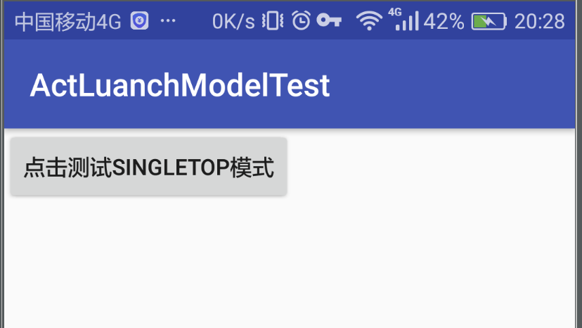


##### 日志

```
26718-26718/com.godfather.actluanchmodeltest D/BaseActivity: onCreate: MainActivity hashCode:77616355 taskId:9304
26718-26718/com.godfather.actluanchmodeltest D/BaseActivity: dumpTaskAffinity: taskAffinity = com.godfather.actluanchmodeltest
26718-26718/com.godfather.actluanchmodeltest D/BaseActivity: onCreate: SingleTopActivity hashCode:138919517 taskId:9304
26718-26718/com.godfather.actluanchmodeltest D/BaseActivity: dumpTaskAffinity: taskAffinity = com.godfather.actluanchmodeltest
26718-26718/com.godfather.actluanchmodeltest D/BaseActivity: onNewIntent: SingleTopActivity hashCode:138919517 taskId:9304
26718-26718/com.godfather.actluanchmodeltest D/BaseActivity: dumpTaskAffinity: taskAffinity = com.godfather.actluanchmodeltest
26718-26718/com.godfather.actluanchmodeltest D/BaseActivity: onNewIntent: SingleTopActivity hashCode:138919517 taskId:9304
26718-26718/com.godfather.actluanchmodeltest D/BaseActivity: dumpTaskAffinity: taskAffinity = com.godfather.actluanchmodeltest

```

##### 案例分析
以SingleTop方式启动的Activity，
当实例存在的情况下：
1、activity存在，并且在栈顶：每次只会执行onNewIntent方法，它会复用已经存在的实例。
并且每次的hashCode都是相同的。

2、activity存在，但是不在栈顶，我们测试一下：

先点击 启动其他Activity

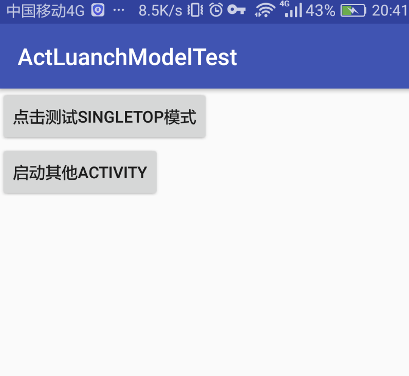
其他Activity页面如下：
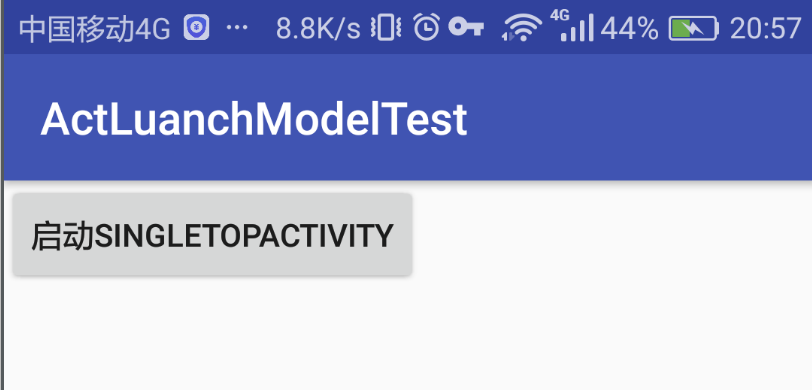
点击启动SingleTopActivty

##### 日志

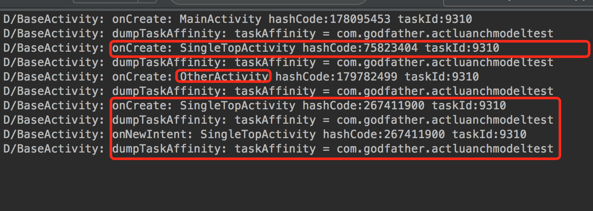
可以看到，singletopActivity 被重新创建，并没有复用。


#### singleTop模式分3种情况

* 当前栈中已有该Activity的实例并且该实例位于栈顶时，不会新建实例，而是复用栈顶的实例，并且会将Intent对象传入，回调onNewIntent方法
* 当前栈中已有该Activity的实例但是该实例不在栈顶时，其行为和standard启动模式一样，依然会创建一个新的实例
* 当前栈中不存在该Activity的实例时，其行为同standard启动模式

#### standard和singleTop启动模式都是在原任务栈中新建Activity实例，不会启动新的Task，即使你指定了taskAffinity属性。
那么什么是taskAffinity属性呢，可以简单的理解为任务相关性。

* 这个参数标识了一个Activity所需任务栈的名字，默认情况下，所有Activity所需的任务栈的名字为应用的包名
* 我们可以单独指定每一个Activity的taskAffinity属性覆盖默认值
* 一个任务的affinity决定于这个任务的根activity（root activity）的taskAffinity
* 在概念上，具有相同的affinity的activity（即设置了相同taskAffinity属性的activity）属于同一个任务
* 为一个activity的taskAffinity设置一个空字符串，表明这个activity不属于任何task
很重要的一点taskAffinity属性不对standard和singleTop模式有任何影响，即时你指定了该属性为其他不同的值，这两种启动模式下不会创建新的task（如果不指定即默认值，即包名）


## 3、singleTask-栈内复用模式
侧重：存在就复用

这种模式相对复杂，它主要侧重在任何情况下的复用，不管实例是否在栈顶，如果不在栈顶，则会将它上面的全部act出栈，自己成为栈顶act，并回调onNewInent方法，其实呢，这个过程它需要匹配自己的任务栈，通过taskAffinity属性指定，如果这个标识的任务栈不存在，则创建，不过一般不需要使用这个属性！

配置形式

```
        <activity
            android:name=".SingleTaskActivity"
            android:launchMode="singleTask" />
```


进入SingleTaskActivity页面

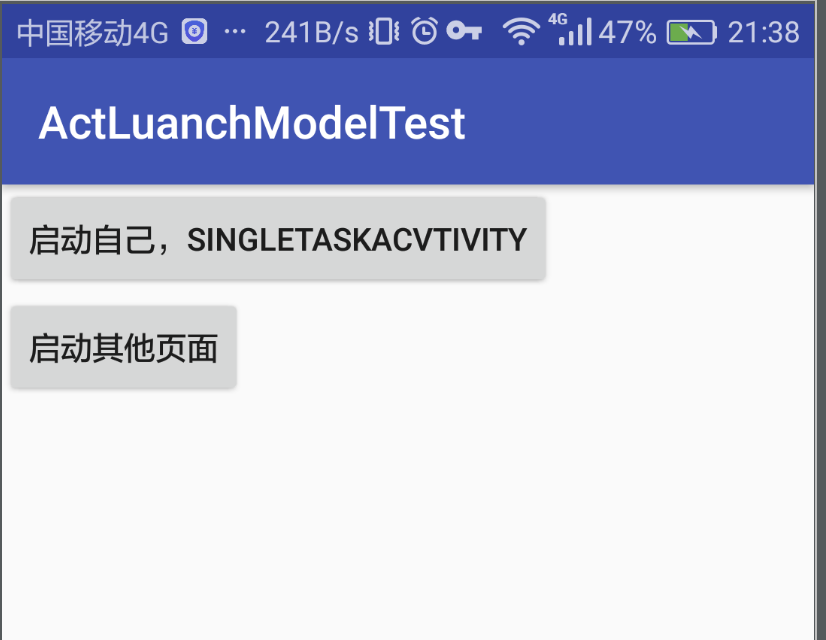


**1、点击启动自己**

日志：

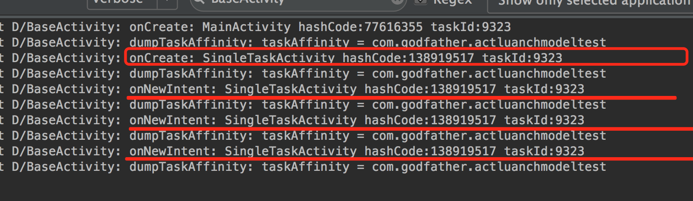
可以发现，每次都是复用自己。

**2、点击 启动其他页面**

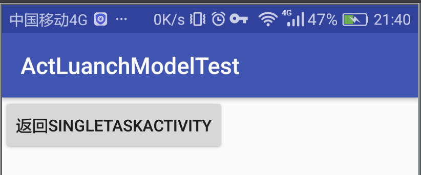

**点击返回 SingleTaskActivity**

日志：

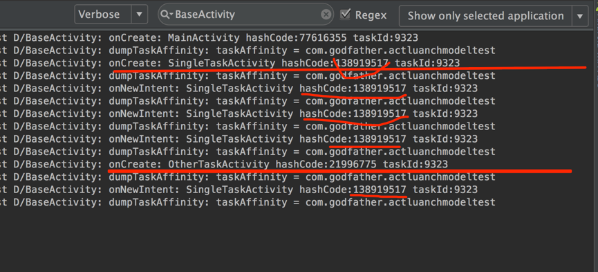

可以发现，复用了非栈顶的实例！！

并且将其他页面（otherTaskActivity）出栈了（点击底部导航栏返回按钮，不能回到otherTaskActivity 页面了。）

任务栈的act实例如图：
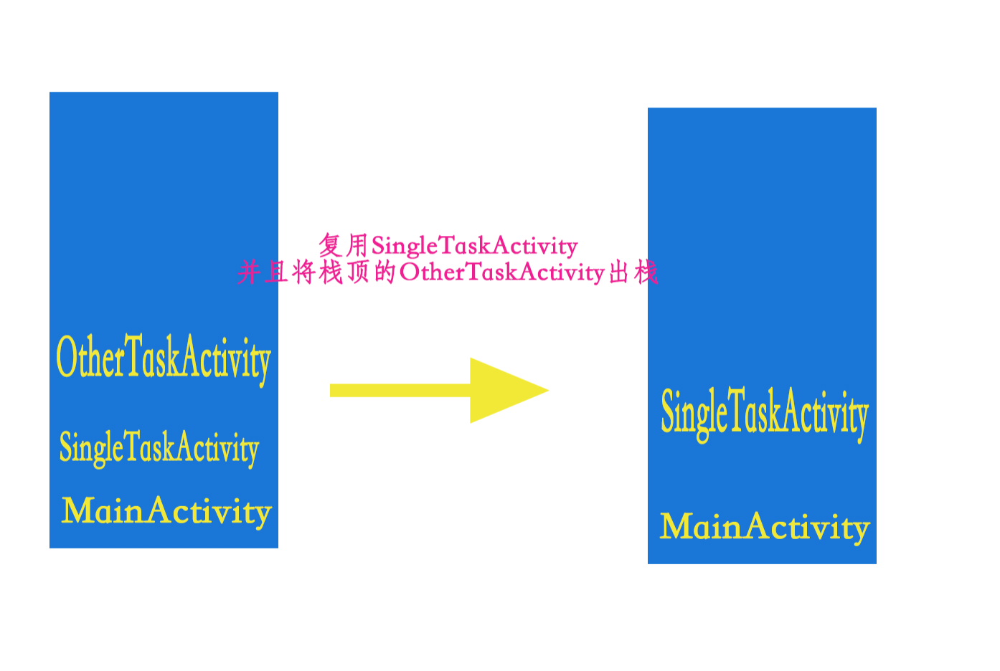

也可以使用adb shell dumpsys activity activities 命令查看任务栈：

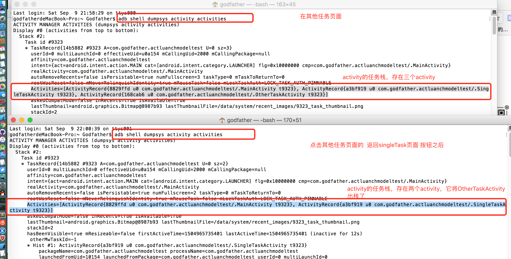


其实是这样的，我们并没有指定taskAffinity属性，这说明和默认值一样，也就是包名，当MainActivity启动时创建的Task的名字就是包名，因为MainActivity也没有指定taskAffinity，而当我们启动SingleTaskActivity ，首先会寻找需要的任务栈是否存在，也就是taskAffinity指定的值，这里就是包名，发现存在，就不再创建新的task，而是直接使用。当该task中存在该Activity实例时就会复用该实例，这就是栈内复用模式。

这时候，如果我们指定SingleTaskActivity 的taskAffinity值。

```
        <activity
            android:name=".SingleTaskActivity"
            android:taskAffinity="com.godfather.actluanchmodeltest.singleTask"
            android:launchMode="singleTask" />
        <!-- android:taskAffinity="singleTask" 指定创建名字为 singnleTask的任务栈-->


```

日志
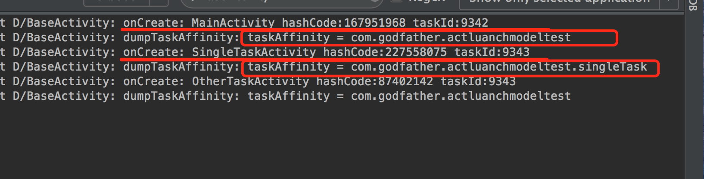


可以发现，TaskID变了，并且OtherTaskActivity的TaskID 跟启动它的activity所在taskID一致。**“谁启动了标准模式的Activity，该Activity就属于启动它的Activity的任务栈中”**

### 结论
singleTask启动模式启动Activity时，首先会根据taskAffinity去寻找当前是否存在一个对应名字的任务栈

* 如果不存在，则会创建一个新的Task，并创建新的Activity实例入栈到新创建的Task中去
* 如果存在，则得到该任务栈，查找该任务栈中是否存在该Activity实例
		1、如果存在实例，则将它上面的Activity实例都出栈，然后回调启动的Activity实例的onNewIntent方法
		2、如果不存在该实例，则新建Activity，并入栈

此外，我们可以将两个不同App中的Activity设置为相同的taskAffinity，这样虽然在不同的应用中，但是Activity会被分配到同一个Task中去。


## singleInstance-全局唯一模式

侧重：它具有singleTask 的全部特征之外，**独占一个任务栈，并且系统的全局唯一性！！**

如果多个应用启动同一个activty页面，则会在不用应用之中可以复用这个页面。执行onNewIntent方法


点击第四个按钮

进入SingleInstance页面：
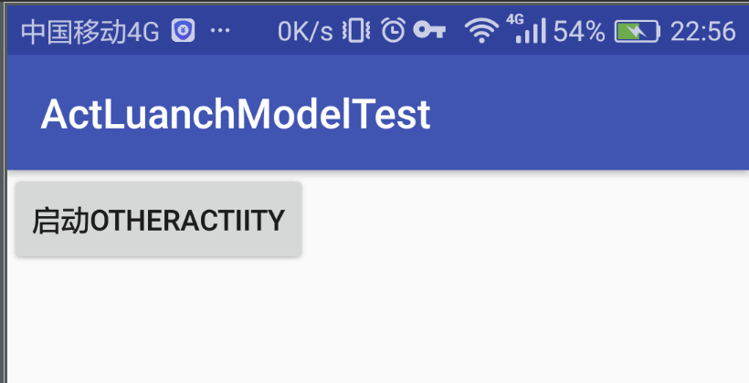

再点击启动OtherActivity
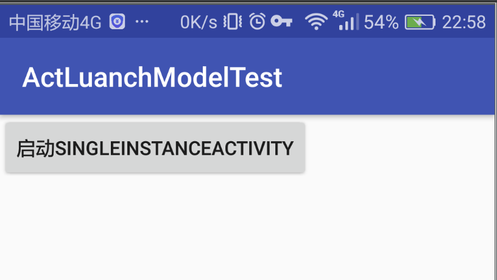
点击启动SingleInstance页面

日志：
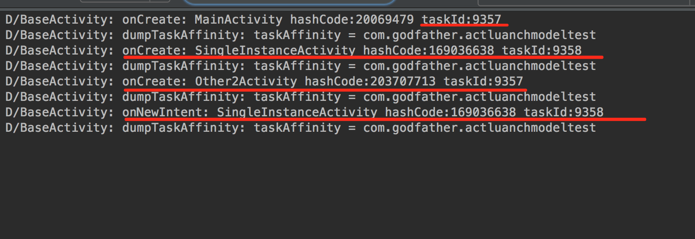


日志发现，它启动的时候，taskID跟MainActivity的不一样，并且在SingleInstance页面启动的OtherActivity的TaskID 也是不与SingleInstanceActivity的相同！
说明SingleInstance是独占任务栈的！


只要实例存在，就会复用，同时它具有SingleTask的全部特性！

至此：Activity的四种启动模式已经讲完。
